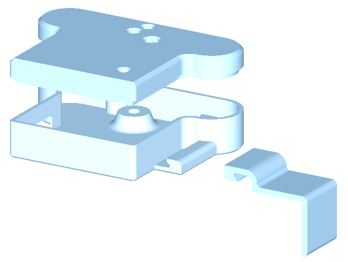
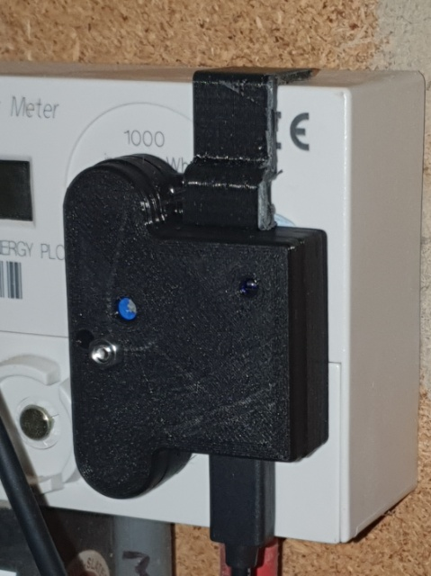
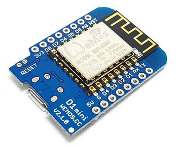
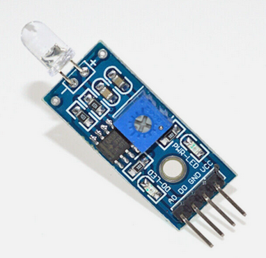
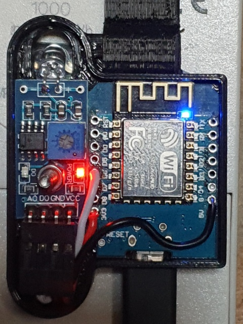

# Home Assistant Glow Compact Case

A compact case for Home Assistant's Glow Energy Reader.

A 3mm screw holds the LM393 down with one nut and the lid in place with another. The 'hook' is simply to help keep the photo diode aligned (the unit is positioned with Blutac).

I suggest printing in black (PLA) to keep out ambient light. Print the lid scaled to 99% for easier fitting. There are 2 holes in the lid for the LM393 indicator and adjuster and for the D1 Mini status LED.

Requires a Wemos D1 Mini ESP8266 (or clone):

and the LM393 Photodiode module:

Wired together like this (apologies for the photo quality):

Note the photo diode is carefully 'folded over' to point through the hole in the case base. I have retained the 90deg headers on the module as the PCB tends to delaminate when de-soldering.

Not heard of Home Assistant Glow? 

- [Home Page](https://glow-energy.io/)
- [Repository](https://github.com/klaasnicolaas/home-assistant-glow)
